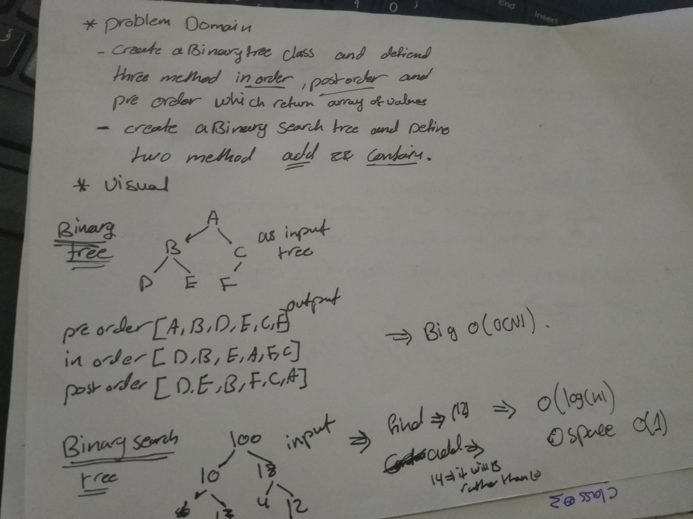

# data-structures-and-algorithms
## Challenge Summary
figure out binary tree , binary search tree and test it .

## Challenge Description
Create a BinaryTree class >> defiend method postorder , inorder and oreorder .
Create a BinarySearchTree >> defiend method of find and add 
## Approach & Efficiency
BinaryTree .... O(n)

BinarySearchTree .... O(log(n))

## solution
