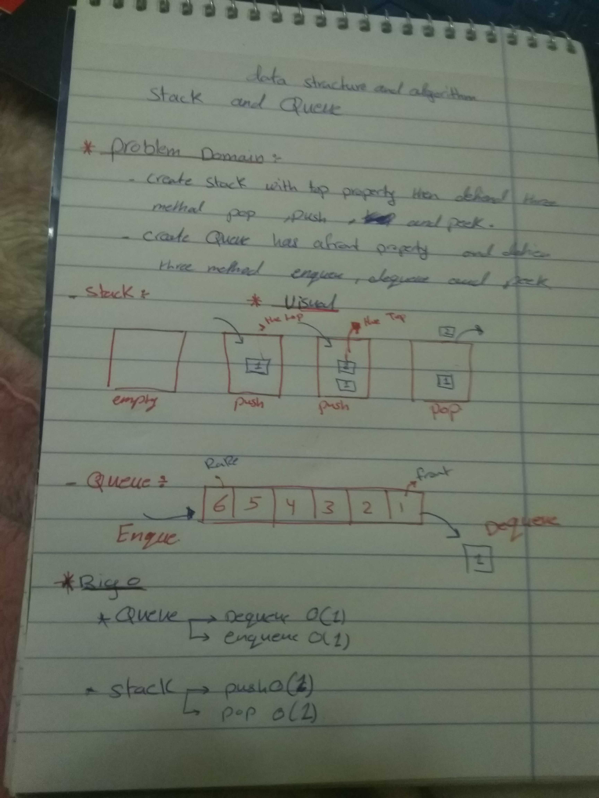

# data-structures-and-algorithms
## Challenge Summary
figure out stack , Queue and test it .

## Challenge Description
build atack  and queue and apply method at it .

## Approach & Efficiency
stack ...... pop ... O(1)
            push ... O(1)

Queue ...... enqueue .. O(1)
      ...... dequeue .. O(1)
solution
