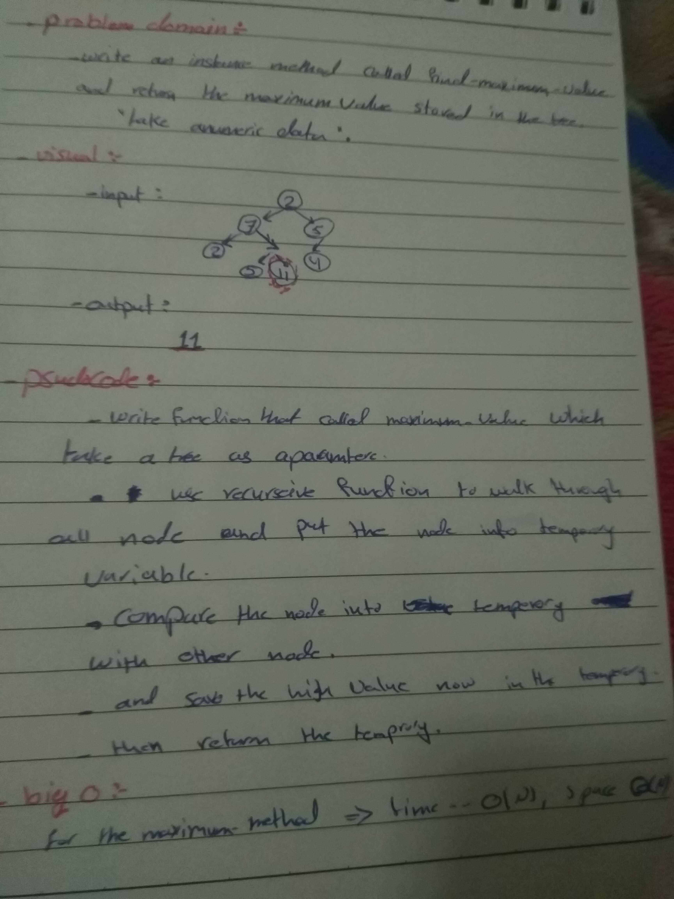

# data-structures-and-algorithms

## Challenge Summary
figure out function to find maximum value of it and test it .

## Challenge Description
Write an instance method called find-maximum-value, return the maximum value stored in the tree. 

## Approach & Efficiency
time.... O(n)
space... O(n)

## solution 
