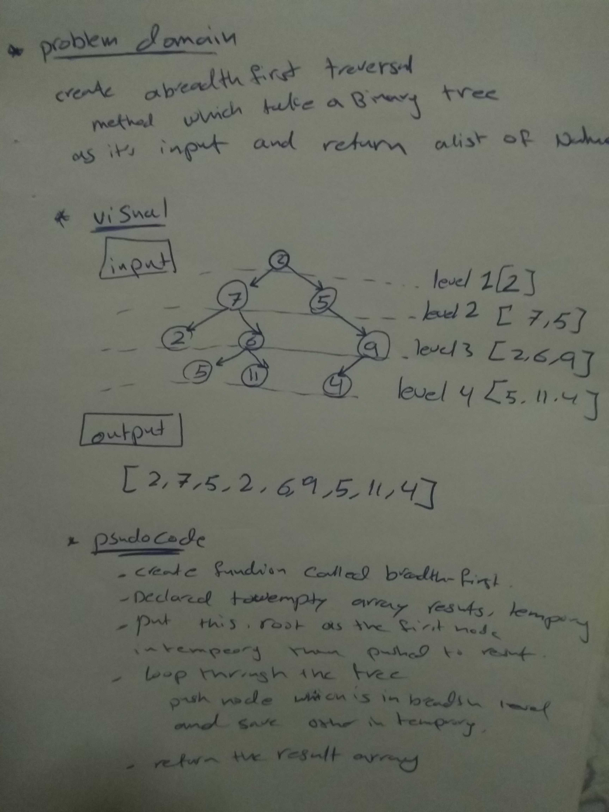

# data-structures-and-algorithms
## Challenge Summary
figure out breadth first array  and test it .

## Challenge Description
 create a breadth first traversal method which takes a Binary Tree as its unique input.
 and return a list of the values in the tree in the order they were encountered.

## Approach & Efficiency
big O <<<>>>
time  .... O(n)
space .....o (n)

## solution 
