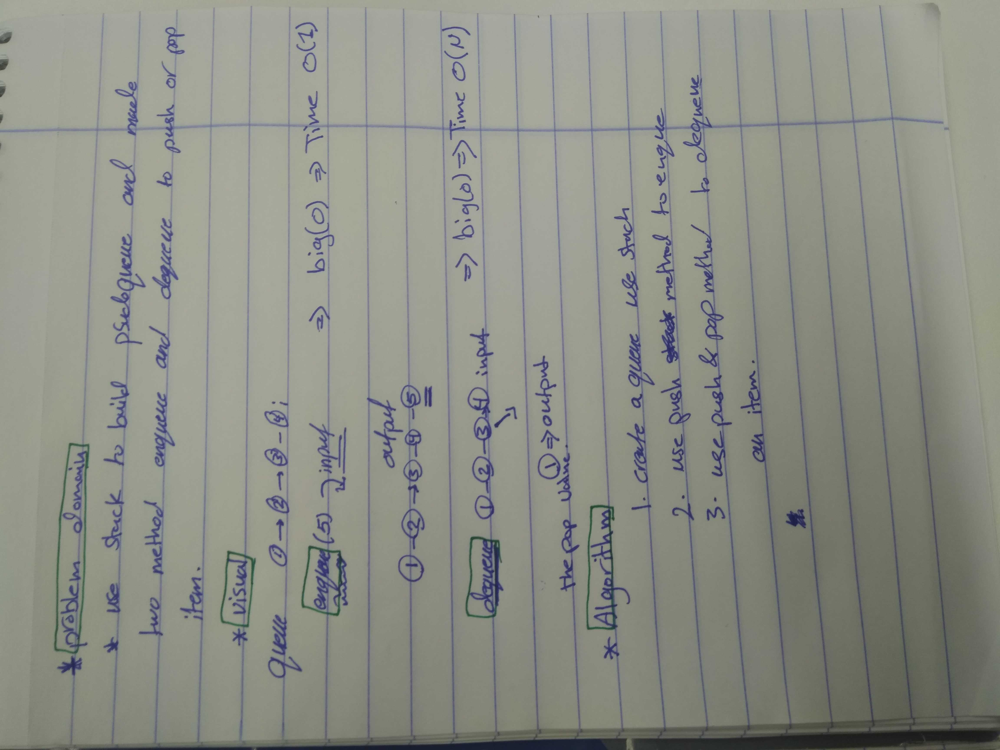

# data-structures-and-algorithms
## Challenge Summary
figure out function and test it .

## Challenge Description

use stack to build psuedoqueue and made two method enqueue and dequeue

## Approach & Efficiency
enqueue >>>  
the big o > time......... o(1)
dequeue >>>
the big o > time......... o(N)
solution
