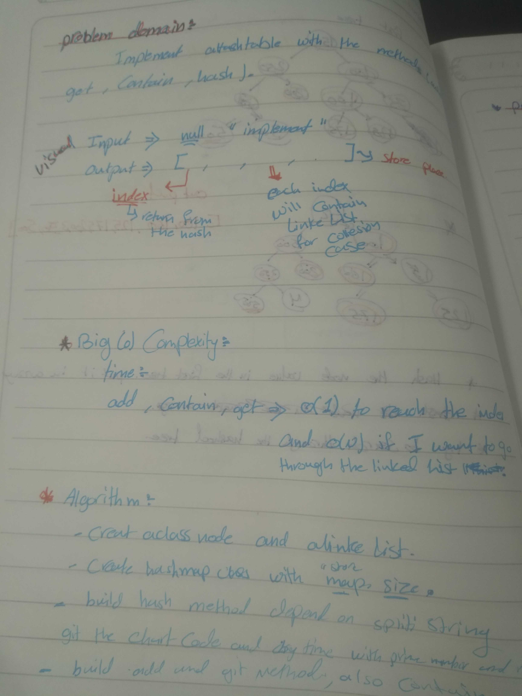

# data-structures-and-algorithms
## Challenge Summary
Implement a Hashtable.

## Challenge Description
Implement a Hashtable with the methods:
(add , get , contains)

## Approach & Efficiency
add time .... O(1).
get time .... O(1)
contains .... O(1)

## solution 
