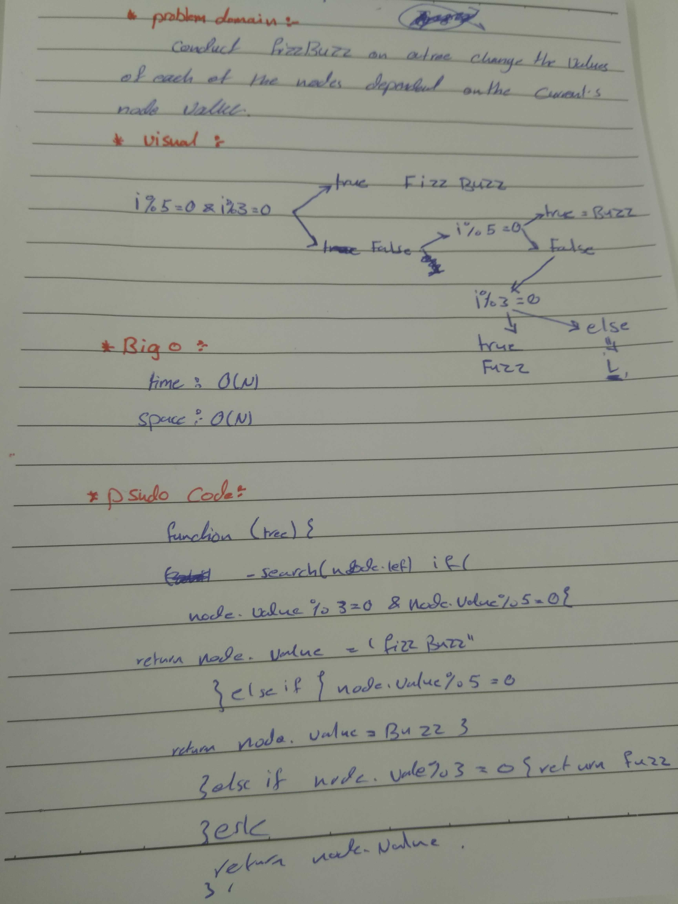

# data-structures-and-algorithms
## Challenge Summary
figure out function and test it .

Challenge Description
Write a function called FizzBuzzTree which takes a tree as an argument. and :
If the value is divisible by 3, replace the value with “Fizz”
If the value is divisible by 5, replace the value with “Buzz”
If the value is divisible by 3 and 5, replace the value with “FizzBuzz”
If the value is not divisible by 3 or 5, simply turn the number into a String.

Approach & Efficiency
big O :
time >> o(n),
space >> o(n).

solution
