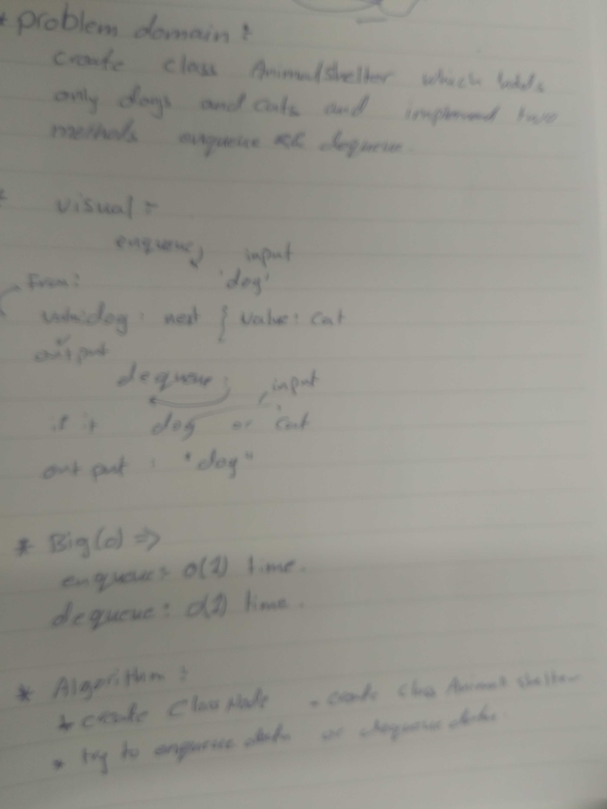

# data-structures-and-algorithms

## challenge summary
figure out class of animal and write test .

## Challenge Description
create class called AnimalShelter and create two method inside it enqueue() and dequeue() 

## Approach & Efficiency
enqueue() >>>> big (O) ..... time O(1)
dequeue() >>>> big (O) ..... time O(1)

## solution 

