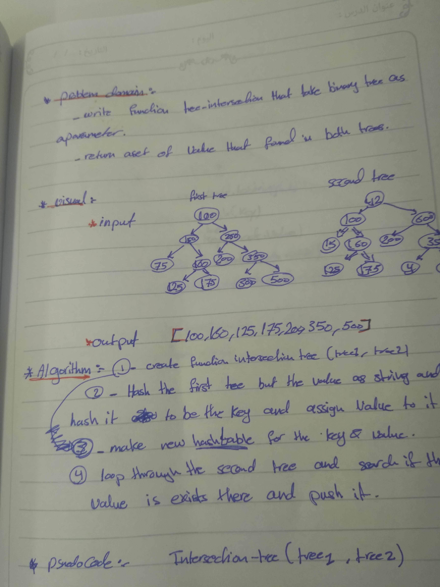
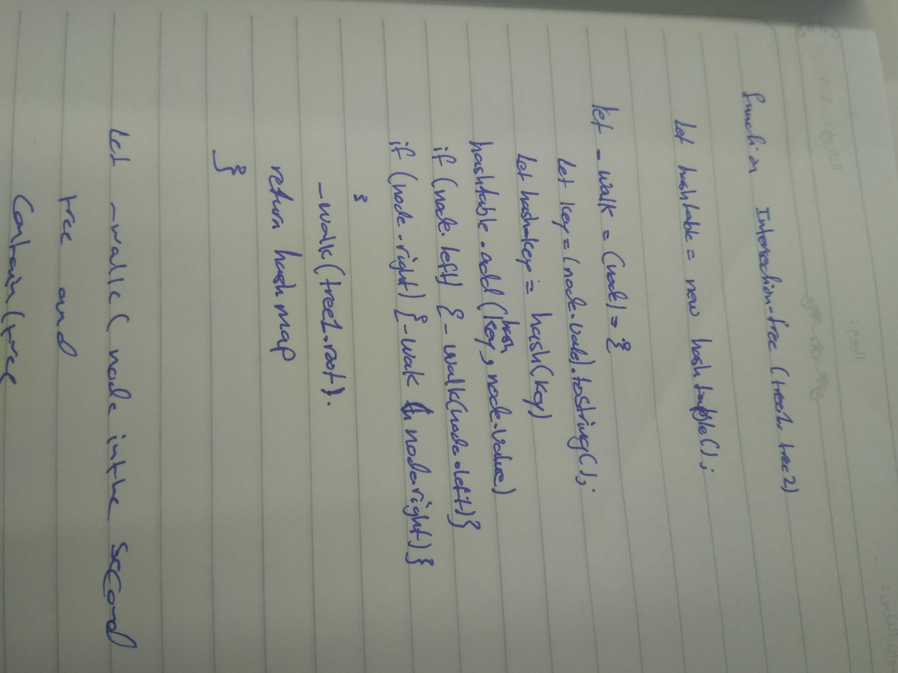

# data-structures-and-algorithms
## Challenge Summary
figure out function and test it .

## Challenge Description
 create function called tree_intersection that takes two binary tree parameters and  return a set of values found in both trees.

## Approach & Efficiency
tree_intersection 
time .... O(n)

## solution

