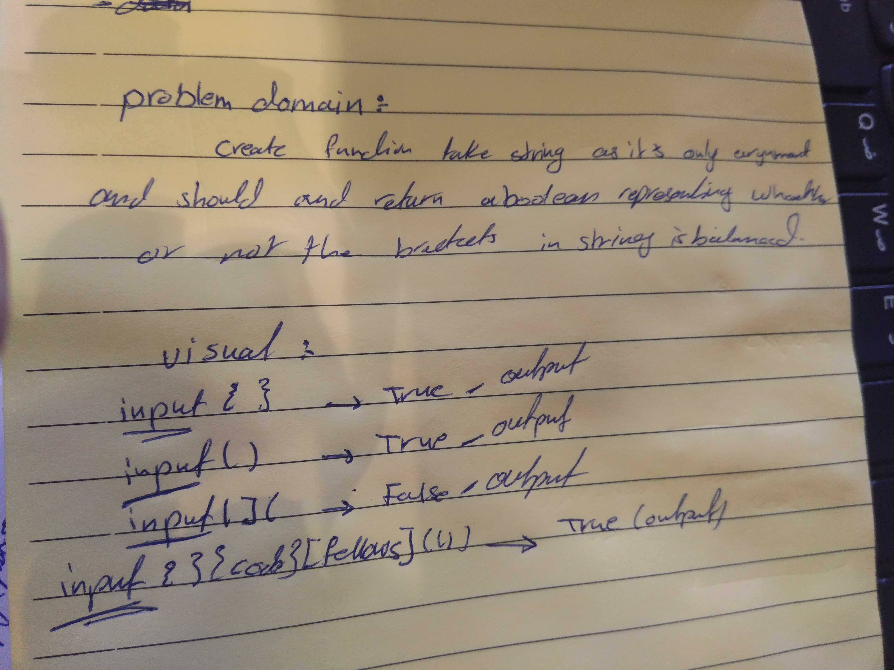

# data-structures-and-algorithm
## Challenge Summary
figure out function and test it .

## Challenge Description
write function isbalance the take a string as input for it and test if the bracket that have is balanced 

## Approach & Efficiency
it has three type of brackets
() , [] , {} 
## solution

